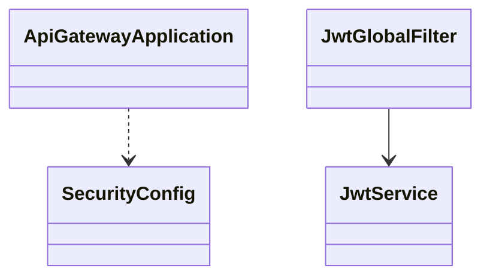
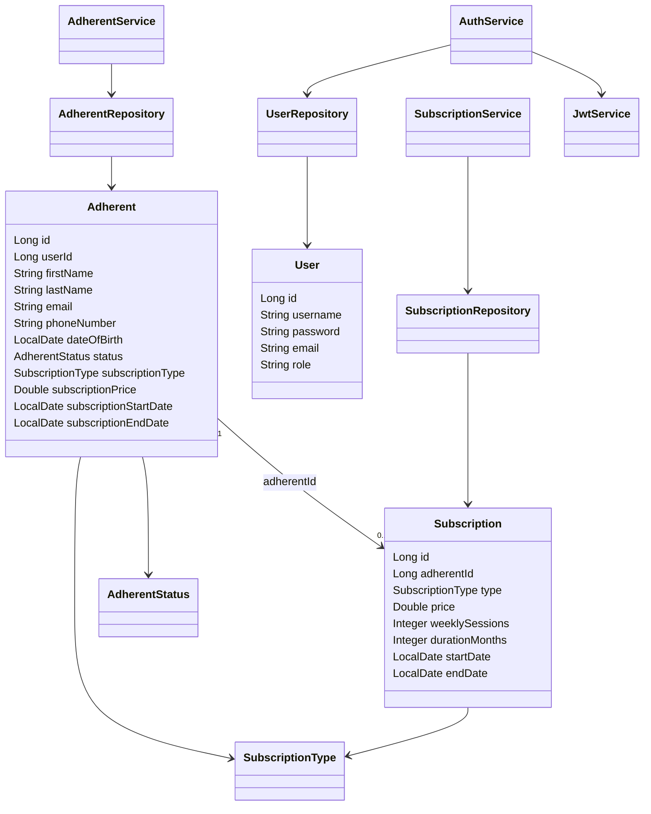
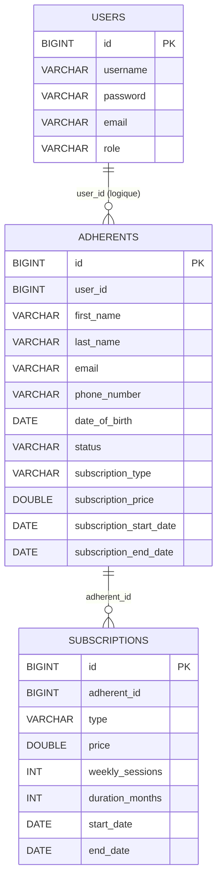
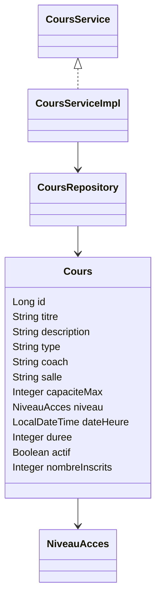
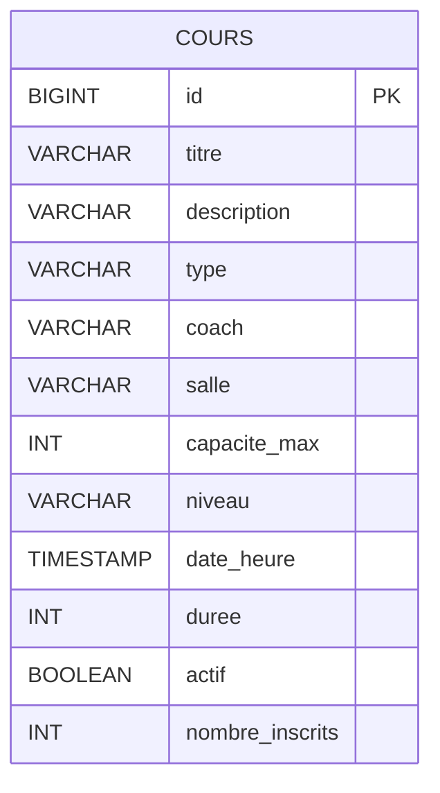
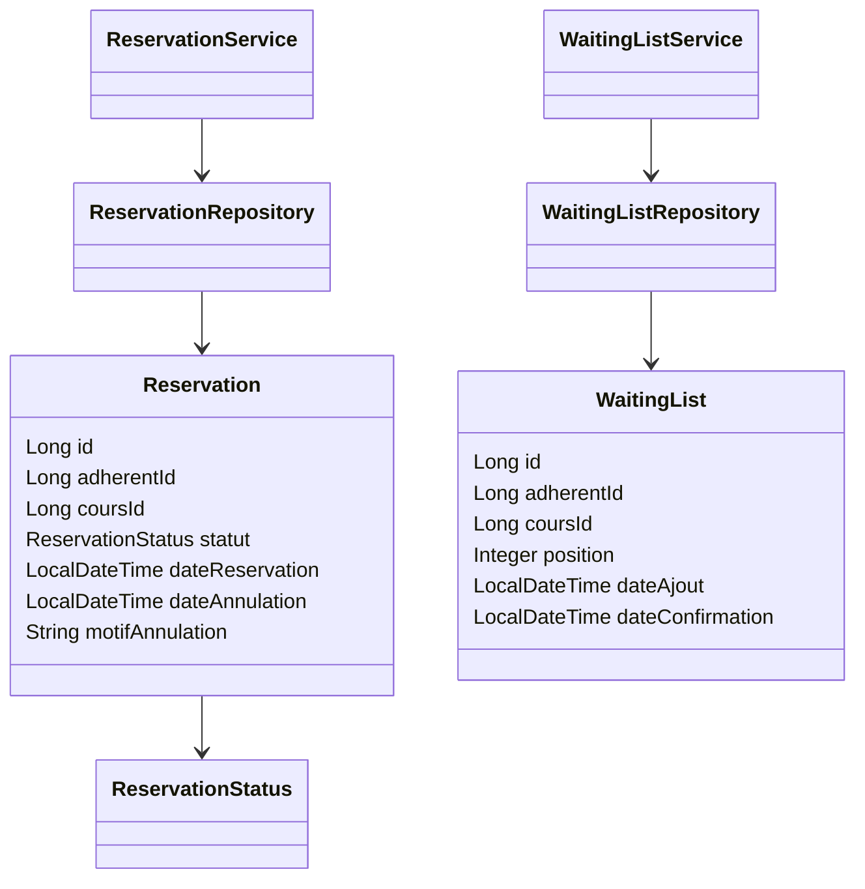
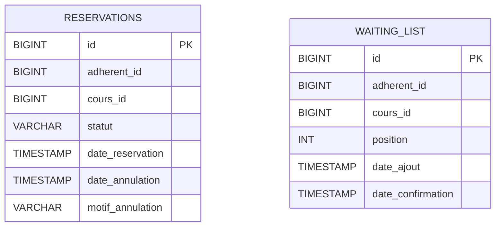
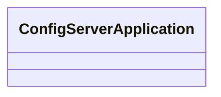
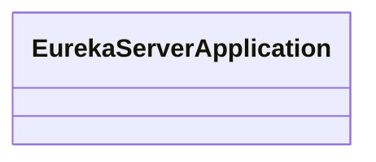
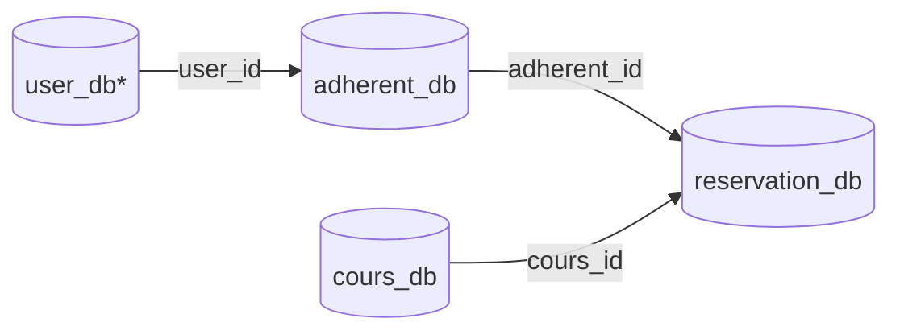

# Microservice Sprotif

## Vue d’ensemble
Ce dépôt regroupe une architecture microservices pour la gestion d’un club sportif (adhérents, cours, réservations). Les services sont fédérés par un **API Gateway**, un **Config Server**, et un **Eureka Server** pour la découverte de services.

## Contexte et objectif
Ce projet vise à découpler les domaines métier (adhésion, cours, réservations) en services autonomes. L’objectif est de **faciliter l’évolution**, **améliorer la maintenabilité**, et **permettre le déploiement indépendant** de chaque composant.

## Fonctionnalités principales
- Gestion des adhérents (création, mise à jour, statut, suspension).
- Gestion des abonnements (type, durée, validité).
- Gestion des cours/séances (capacité, disponibilité, niveau d’accès).
- Réservations et liste d’attente.
- Authentification JWT et propagation du contexte utilisateur.
- Routage centralisé et configuration distribuée.

## Technologies utilisées
- **Backend** : Java, Spring Boot, Spring Web, Spring Data JPA
- **Cloud** : Spring Cloud Gateway, Config Server, Eureka
- **Sécurité** : JWT
- **Base de données** : PostgreSQL
- **Frontend** : React + Vite
- **Docs & diagrammes** : Mermaid

> **Remarque** : La configuration du Gateway référence `auth-service` et `user-service`, mais leurs sources ne sont pas présentes dans ce dépôt. Ils sont donc listés comme services externes/attendus.

## Architecture globale

```mermaid
flowchart LR
  subgraph Client
    FE[Frontend Vite React]
  end

  FE -->|HTTP| GW[API Gateway]

  GW -->|Routes| AD[Adherent Service]
  GW -->|Routes| CO[Cours Service]
  GW -->|Routes| RS[Reservation Service (sport)]
  GW -.->|Routes| AU[Auth Service*]
  GW -.->|Routes| US[User Service*]

  CS[Config Server] --> GW
  CS --> AD
  CS --> CO
  CS --> RS
  CS -.-> AU
  CS -.-> US

  EU[Eureka Server] <--> GW
  EU <--> AD
  EU <--> CO
  EU <--> RS
  EU -.-> AU
  EU -.-> US

  AD --> DB1[(adherent_db)]
  CO --> DB2[(cours_db)]
  RS --> DB3[(reservation_db)]
  US -.-> DB4[(user_db*)]
```

## Services (résumé)

| Service | Rôle | Port | Base de données |
|---|---|---|---|
| API Gateway | Routage + filtres JWT (WebFlux) | 8080 | — |
| Adherent Service | Gestion adhérents, abonnements, utilisateurs | 8081 | adherent_db |
| Cours Service | Gestion cours/séances | 8084 | cours_db |
| Reservation Service (sport) | Réservations + liste d’attente | 8085 | reservation_db |
| Config Server | Configuration centralisée | — | — |
| Eureka Server | Découverte de services | — | — |
| Auth Service* | Authentification | — | — |
| User Service* | Profil utilisateur | 8083 | user_db |

> *Services référencés dans la configuration mais absents du code source dans ce dépôt.

---

# Documentation par service

## 1) API Gateway
**Chemin** : services/api-gateway

**Responsabilités**
- Routage des requêtes vers les microservices.
- Filtrage JWT global (validation + propagation des headers utilisateurs).
- CORS centralisé.

**Classes clés**
- `ApiGatewayApplication`
- `SecurityConfig`
- `JwtGlobalFilter`
- `JwtService`

**Diagramme de classes**



---

## 2) Adherent Service
**Chemin** : services/adherent-service

**Responsabilités**
- CRUD des adhérents.
- Gestion des abonnements (types, durée, règles métier).
- Authentification interne (utilisateurs + JWT).

**Classes clés**
- Domaine : `Adherent`, `Subscription`, `User`
- Services : `AdherentService`, `SubscriptionService`, `AuthService`
- Repositories : `AdherentRepository`, `SubscriptionRepository`, `UserRepository`
- Sécurité : `JwtService`

**Diagramme de classes**



**Architecture de base de données**



---

## 3) Cours Service
**Chemin** : services/service-cours/backend

**Responsabilités**
- Création et planification des cours.
- Contrôle de capacité et disponibilité.
- Accès selon abonnement (niveau d’accès).

**Classes clés**
- Domaine : `Cours`, `NiveauAcces`
- Services : `CoursService`, `CoursServiceImpl`
- Repository : `CoursRepository`

**Diagramme de classes**



**Architecture de base de données**



---

## 4) Reservation Service (sport)
**Chemin** : services/sport

**Responsabilités**
- Réservations de séances (création/annulation/statuts).
- Gestion de la liste d’attente.
- Vérification d’éligibilité.

**Classes clés**
- Domaine : `Reservation`, `WaitingList`, `ReservationStatus`
- Services : `ReservationService`, `WaitingListService`
- Repositories : `ReservationRepository`, `WaitingListRepository`

**Diagramme de classes**



**Architecture de base de données**



---

## 5) Config Server
**Chemin** : services/config-server

**Responsabilités**
- Centraliser la configuration de tous les services (ports, DB, JWT, CORS, routes Gateway).

**Diagramme de classes**



---

## 6) Eureka Server
**Chemin** : services/eureka-server

**Responsabilités**
- Registre de service pour la découverte dynamique (service registry).

**Diagramme de classes**



---

## 7) Frontend (UI)
**Chemin** : frontend

**Responsabilités**
- Interface utilisateur (authentification, gestion adhérents, cours, réservations).
- Consommation des APIs via l’API Gateway.

---

## Architecture de base de données (globale)
Chaque service possède sa base dédiée. Les relations inter-domaines passent par des **identifiants** (ex: `adherent_id`, `cours_id`) et non par des clés étrangères inter-bases.



---

## Notes & conventions
- Les diagrammes Mermaid sont rendus automatiquement par GitHub et VS Code.
- Les services communiquent via HTTP REST et utilisent PostgreSQL pour la persistance.
- JWT est utilisé pour l’authentification et l’autorisation côté Gateway et services.
